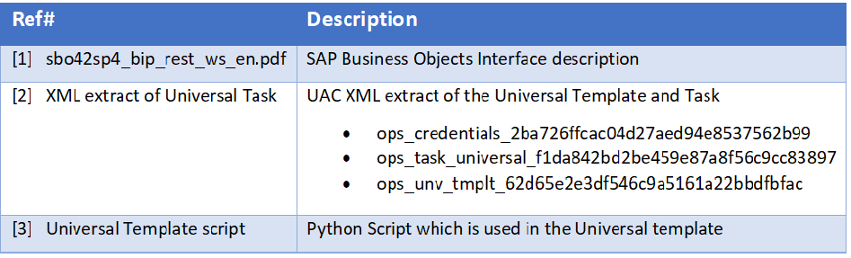

# ut-sap-bo-v4-2-schedulenow-win
# Abstract: 

This Universal Task allows to schedule any SAP Business Object schedulable resource including Crystal reports or WebI reports by calling the SAP Business Objects “Schedule now” REST Webservice API Command.

# 1.	Disclaimer

No support and no warranty are provided by Stonebranch GmbH for this document and the related Universal Task. The use of this document and the related Universal Task is on your own risk.

Before using this task in a production system, please perform extensive testing.

Stonebranch GmbH assumes no liability for damage caused by the performance of the Universal Tasks

# 2.	Introduction

Business Objects 4.x comes with a RESTful web service SDK. The Business Intelligence platform RESTful web service SDK lets you access the BI platform using the HTTP protocol and allows to schedule any Schedulable resources include documents, for example Crystal reports and WebI reports.

The here described Universal Task calls the “Schedule now” REST Webservice to run e.g. a Crystal report or WebI report from Universal Automation Center.

Details on the RESTful web service SDK can be found here [1]:

Some details about the universal task for BO:
-	It is based on the standard SAP BO REST Interface, which was introduced with SAP BO 4.x 
-	The SAP BO REST Interface is called from a Universal Agent running on a Windows Server
-	With minor adjustments the task also runs on a Universal Agent for Linux/Unix. 
-	The Windows Server needs to have Python 3.6.3 installed
-	Any Additional SAP BO REST API command as listed in [1] can also be implemented using the same approach. 
-	An extract of the Python script, which is called as part of the Universal template can be found here [3] or can be looked up in the controller under the Universal template
-	Exit code processing has been added to the universal task script:
      - In case a report fails E.g. If you provide a wrong Business Object ID, it will fail, and you can re-start the job with the correct ID. 
      -	In case of a connection error the task will fail e.g. wrong IP address or Port of the SAP BO HOST
      -	In case a wrong password has been entered the instance will fail
 
-	You can configure all connection Parameters via the Universal Task
-	Restriction: Currently only “Enterprise Security” is supported
-	You can select different log-levels e.g. Info and debug

# 3	Installation
# 3.1	Software Requirements
**Universal Task name:** SAPBO_REST_SchdeuleForms_now

**Related UAC XML Files for template and task: [2]**

**Software used:** 

For the set-up you need:
1.	Python 3.6.3 for Windows installed on a server where a Universal Agent is installed. 
2.	For Python the following modules are required: 
    -	requests, to perform the REST connection towards the PC SOAP API
    -	argparse, to allow testing of the Universal Template script on the command line
    -	sys, for output re-direct processing
    -	datetime, date and time stamps for messages
    
  Note: Only the module requests need to be added to python 3.6.3
  
3.	Universal Controller 6.4.2.x 
4.	Universal Agent 6.3.0.3 or higher installed on a Windows Server
5.	SAP BusineesObjects Business Intelligence platform 4.2

# 3.2	Installation Steps
The following describes the installation steps:

**1.	Install Python 3.6.3 for Windows on the Universal Controller server or any Windows Server running a Universal Agent.**

Official Download link: https://www.python.org/downloads/

Note: 

Install python with the options: 
-	add python to windows path
-	Install for all users

**2.	Add the request module to your python installation**

In a dos command shell run as Administrator:

*pip install requests*

Note: The module requests contain the commands to perform the REST commands towards the SAPBO Webservice API. 

It is assumed that the modules argparse, sys, datetime, logging are already available. If not install them via pip.

**3.	Import the Universal Task including the Universal Template to your Controller**

Go to “All Tasks” and load via the Import functionality the Universal Task configuration into the Controller. 

   Image 1
   
   
   
   Image 2
   
   

# 4.	Universal Task Configuration

**1.	Activate: Resolvable Credentials in Universal Automation Center:**

  Image 3
   
   
   
**2.	Fill Out the Universal Task for each Report to be scheduled:**

  Image 4
  
  
  
**Credential for Universal Task:**

Image 5

**Description**

-	SAP BO Host: Server where SAP Business Objects is installed
-	SAP BO Port: Default Port of SAP BO
-	SAP BO Credentials to execute the SAP BO Report
-	Business Object ID: Resource ID for scheduling e.g. ID of the Crystal Report 

This ID can be looked up in the SAPBO Central Management Console (see screenshots below)

# 5.	SAP Business Objects

The following provides to non-SAP BO Consultants an Introduction how to find the Business Object ID and how to verify that a report has been executed successfully in SAP BO.

# 5.1	How to look up the Business Object ID:

**1.	Log-in to the SAP BO Central Management Console**

Image 6

**2.	Log-in to the SAP BO Central Management Console**

Browse to Folders -> All folders -> Report Samples -> “income statement”
and look up the “general properties”

Image 7

Image 8

**Business Object ID: 5725**

# 5.2	Verify Task execution

**1.	Log-in to the SAP BO Central Management Console**

Image 9

**2.	Log-in to the SAP BO Central Management Console**

Browse to Folders -> All folders -> Report Samples -> “income statement”
and look up the “History”.

Image 10

Image 11

# 6.	Test Cases

The following basic test cases has been performed:

Image 12

# 7.	Document References

1.This document references the following documents:

Image 13

